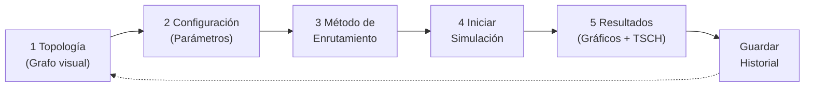

# 6TiSCH Interactive Simulator — Plan de Implementación Completo

> **Objetivo**: Construir una aplicación web interactiva y visualmente impresionante para simular, configurar y visualizar resultados de enrutamiento en redes 6TiSCH (NG-RES), portando toda la lógica de `mo_sp_pt1` al navegador y exponiendo una API Python que ejecute MATLAB opcionalmente.

---

## Resumen Ejecutivo

La herramienta reemplaza el flujo manual de MATLAB + Python con un **software de simulación interactivo de nivel profesional** que puede presentarse en la defensa de magíster como evidencia de transferencia tecnológica del trabajo de investigación. Se inspira directamente en el [6TiSCH Simulator GUI](file:///c:/Users/Benjamin/Desktop/seminario_udp/simulator/gui) pero va mucho más lejos en visualización e interactividad.

---

## Stack Tecnológico Propuesto

### Frontend — Next.js 14 (App Router) + TypeScript

| Necesidad | Librería | Por qué |
|---|---|---|
| Framework web | **Next.js 14** (App Router) | SSR/SSG, routing limpio, ideal para dashboards complejos |
| Visualización de grafos | **Cytoscape.js** | El estándar para grafos interactivos en web; soporta layouts, clics en nodos, animación de rutas |
| Gráficos de resultados | **Recharts** + **D3.js** | Recharts para charts declarativos (barras, líneas); D3 para la tabla TSCH personalizada |
| Estilos | **Tailwind CSS** + **CSS Variables** | Rapidez + theming oscuro premium |
| Animaciones | **Framer Motion** | Transiciones de páginas y micro-animaciones |
| Estado global | **Zustand** | Ligero, sin boilerplate, perfecto para configuración + resultados |
| Tablas interactivas | **TanStack Table v8** | Tabla TSCH con ordenamiento, filtros, exportación |
| Notificaciones | **Sonner** | Toasts elegantes para eventos de simulación |
| Iconos | **Lucide React** | Consistente, moderno |

### Backend — FastAPI (Python)

| Necesidad | Tecnología |
|---|---|
| API REST | **FastAPI** (async, auto-docs en /docs) |
| Ejecución de MATLAB | **subprocess** → `matlab -batch` o **matlab-engine-for-python** si disponible |
| Lógica portada en Python | Todos los algoritmos de `mo_sp_pt1` reescritos en Python/NumPy (fallback sin MATLAB) |
| Persistencia de historial | **SQLite** vía `aiosqlite` + JSON plano |
| WebSockets | FastAPI WebSocket para progreso en tiempo real |
| Packaging | `pyproject.toml` + `uv` |

### Arquitectura de Ejecución — Doble Motor

```
┌─────────────────────────────────────────┐
│           Next.js Frontend              │
│  (Cytoscape.js + Recharts + TanStack)   │
└───────────────┬─────────────────────────┘
                │ REST / WebSocket
┌───────────────▼─────────────────────────┐
│         FastAPI Backend (Python)        │
│  ┌──────────────┐  ┌───────────────┐   │
│  │  Python/NumPy│  │ MATLAB Engine │   │
│  │  (siempre    │  │ (si instalado,│   │
│  │  disponible) │  │ más rápido)   │   │
│  └──────────────┘  └───────────────┘   │
│         SQLite (historial)              │
└─────────────────────────────────────────┘
```

> [!NOTE]
> **Sobre MATLAB en web**: No es posible ejecutar MATLAB directamente en el navegador. La estrategia es: el backend Python llama a `matlab -batch "script"` via subprocess, captura el JSON de salida, y lo sirve al frontend. Si MATLAB no está disponible, el motor Python puro (reimplementación en NumPy/NetworkX) actúa como fallback. Esto hace al software 100% funcional en cualquier máquina, con MATLAB como acelerador opcional.

---

## Estructura de Carpetas del Proyecto

```
software/
├── app/                          ← Next.js App Router
│   ├── layout.tsx                ← Root layout (font, theme, providers)
│   ├── page.tsx                  ← Landing / redirect
│   ├── (simulator)/
│   │   ├── layout.tsx            ← Shell con sidebar nav
│   │   ├── topology/page.tsx     ← Paso 1: Topología + grafo
│   │   ├── config/page.tsx       ← Paso 2: Configuración de parámetros
│   │   ├── routing/page.tsx      ← Paso 3: Elección de método
│   │   ├── results/page.tsx      ← Paso 4-5: Resultados y TSCH
│   │   └── history/page.tsx      ← Historial de ejecuciones
│   └── api/                      ← Next.js API routes (proxy al backend)
│       └── proxy/[...path]/route.ts
│
├── components/
│   ├── graph/
│   │   ├── TopologyGraph.tsx      ← Grafo Cytoscape.js interactivo
│   │   ├── RouteHighlighter.tsx   ← Animación de ruta al clicar emisor
│   │   └── GraphLegend.tsx
│   ├── tsch/
│   │   ├── TSCHScheduleGrid.tsx   ← Grilla tiempo/canal estilo Gantt
│   │   └── TSCHFlowTable.tsx      ← Tabla de flows con deadlines
│   ├── charts/
│   │   ├── OverlapChart.tsx       ← Barras de overlaps por método
│   │   ├── SchedulabilityGauge.tsx ← Gauge de schedulability
│   │   └── HopsDistribution.tsx
│   ├── config/
│   │   ├── ParameterPanel.tsx     ← Panel de sliders/inputs
│   │   └── GatewaySelector.tsx    ← Clic en nodo del grafo
│   └── ui/                        ← Componentes base (Button, Card, Badge...)
│
├── lib/
│   ├── store.ts                   ← Zustand global store
│   ├── api-client.ts              ← Wrapper fetch para FastAPI
│   └── types.ts                   ← TypeScript interfaces
│
├── styles/
│   └── globals.css                ← Design tokens, dark mode
│
├── public/
│   └── ...
│
├── backend/                       ← FastAPI Python backend
│   ├── main.py                    ← Entry point FastAPI
│   ├── routers/
│   │   ├── topology.py            ← /topology/generate, /topology/dataset
│   │   ├── routing.py             ← /routing/run
│   │   ├── simulation.py          ← /simulation/run (WebSocket)
│   │   ├── history.py             ← /history CRUD
│   │   └── matlab.py              ← /matlab/status, /matlab/run
│   ├── engine/
│   │   ├── topology_gen.py        ← Puerto de generate_random_topology.m
│   │   ├── routing_sp.py          ← Shortest Path (NetworkX)
│   │   ├── routing_mo.py          ← Minimal Overlap
│   │   ├── routing_moaco.py       ← MO + ACO
│   │   ├── routing_qlearning.py   ← Q-Learning
│   │   ├── routing_sarsa.py       ← SARSA
│   │   ├── routing_gnn.py         ← GNN (PyTorch Geometric, opcional)
│   │   ├── flows.py               ← build_flow_set, generate_periods_harmonic
│   │   ├── metrics.py             ← overlaps, schedulability, contention, conflict
│   │   └── matlab_bridge.py       ← subprocess wrapper para MATLAB
│   ├── models/
│   │   ├── simulation.py          ← Pydantic models
│   │   └── history.py
│   ├── db/
│   │   └── database.py            ← SQLite setup + aiosqlite
│   └── pyproject.toml
│
├── package.json
├── next.config.mjs
├── tailwind.config.ts
└── tsconfig.json
```

---

## Flujo de Usuario — 5 Pasos Interactivos



---

## Plan de Implementación por Partes

---

### PARTE 1 — Fundación y Setup del Proyecto

#### [NEW] `software/` — Inicialización
- Crear proyecto Next.js 14 con TypeScript y Tailwind
- Configurar FastAPI backend con estructura de carpetas
- Configurar CORS y proxy desde Next.js hacia FastAPI
- Definir design system completo: paleta oscura premium, tipografía (Inter), variables CSS

**Design System:**
- Fondo: `#0a0d14` (dark navy)
- Superficie: `#111827` / `#1a2235`
- Acento primario: `#6366f1` (indigo vibrante)
- Acento secundario: `#22d3ee` (cyan)
- Verde schedulable: `#10b981`
- Rojo no-schedulable: `#ef4444`
- Tipografía: `Inter` + `JetBrains Mono` (para tablas/código)

---

### PARTE 2 — Backend Python: Motor de Simulación

#### [NEW] `backend/engine/topology_gen.py`
Porto directo de `generate_random_topology.m` y `select_gateway.m` usando **NetworkX**.

```python
# Ejemplo del puerto
import networkx as nx
import numpy as np

def generate_random_topology(N: int, lambda_: float) -> nx.Graph:
    density = lambda_ / N
    # equivalente a sprand + forzar conectividad
    ...
```

#### [NEW] `backend/engine/routing_*.py`
Porto de cada algoritmo de `mo_sp_pt1/routing/`:
- `routing_sp.py` → `nx.shortest_path`
- `routing_mo.py` → MO iterativo con penalización de pesos
- `routing_moaco.py` → ACO sobre el grafo
- `routing_qlearning.py` → Q-table con estados = nodos
- `routing_sarsa.py` → On-policy SARSA
- `routing_gnn.py` → Placeholder GNN (PyTorch Geometric, opcional)

#### [NEW] `backend/engine/metrics.py`
Porto de `mo_sp_pt1/metrics/`:
- `compute_total_overlaps`
- `compute_schedulability_status`
- `compute_contention_demand_window`
- `compute_conflict_demand_window`
- `generate_sched_windows`

#### [NEW] `backend/engine/matlab_bridge.py`
```python
import subprocess, json, sys

def is_matlab_available() -> bool:
    result = subprocess.run(["matlab", "-batch", "disp('ok')"], ...)
    return result.returncode == 0

def run_matlab_routing(script: str, params: dict) -> dict:
    # Genera script temporal, llama matlab -batch, parsea JSON de stdout
    ...
```

#### [NEW] `backend/routers/simulation.py` — WebSocket
```python
@router.websocket("/ws/simulate")
async def simulate_ws(websocket: WebSocket):
    # Envía progreso de: topology → routing → metrics → done
    await websocket.send_json({"step": "topology", "progress": 0.2})
    ...
```

---

### PARTE 3 — Visualización del Grafo (Cytoscape.js)

#### [NEW] `components/graph/TopologyGraph.tsx`

**Funcionalidades:**
- Render del grafo con layout `cola` (force-directed, optimizado para redes IoT)
- Nodos diferenciados: Gateway (estrella dorada), Sensores (círculos cyan)
- Aristas con grosor proporcional al peso (overlap)
- **Al clicar un sensor**: ruta iluminada con animación de flujo (dash-animation)
- **Selección manual de gateway**: clic derecho o modo "gateway selection" con highlight
- Zoom, pan, fit-to-screen
- Tooltips al hover: ID nodo, grado, betweenness centrality
- Exportar imagen PNG del grafo

**Estilo visual inspirado en redes IoT académicas:**
```js
// Cytoscape style
{
  selector: 'node[type="gateway"]',
  style: {
    'background-color': '#f59e0b',
    'border-color': '#fbbf24',
    'border-width': 3,
    shape: 'star',
    width: 40, height: 40,
    label: 'GW',
    'font-family': 'JetBrains Mono'
  }
},
{
  selector: 'node[type="sensor"]',
  style: {
    'background-color': '#1e40af',
    'border-color': '#60a5fa',
    shape: 'ellipse',
  }
},
{
  selector: 'edge.highlighted',
  style: {
    'line-color': '#22d3ee',
    'line-dash-pattern': [6, 3],
    width: 4,
    'z-index': 10
  }
}
```

---

### PARTE 4 — Panel de Configuración

#### [NEW] `components/config/ParameterPanel.tsx`

Todos los parámetros de `config_default.m` expuestos como controles UI:

| Parámetro | Control UI | Rango |
|---|---|---|
| `N` (nodos) | Slider | 10 – 100 |
| `lambda` (densidad) | Slider multi-value | 4, 8, 12 |
| `n_range` (sensores) | Range slider dual | 2 – 30 |
| `k_max` | Slider | 10 – 500 |
| `m_fixed` (canales TSCH) | Slider | 2 – 16 |
| `H` (hyperperiodo) | Select | 64, 128, 256 |
| `eta_min/max` | Dual slider | 1 – 10 |
| `use_implicit_deadlines` | Toggle switch | — |
| `conflict_pair_mode` | Radio group | paper_double / single |
| Gateway selection | Toggle | Auto / Manual (clic en grafo) |

**Gateway Manual:** Al activar modo manual, el grafo entra en modo de selección → el nodo clicado se convierte en gateway (se resalta con corona dorada animada).

---

### PARTE 5 — Selección de Método y Ejecución

#### [NEW] `app/(simulator)/routing/page.tsx`

Cards visuales para cada método con descripción breve:

```
┌─────────────┐ ┌─────────────┐ ┌─────────────┐
│   SP        │ │    MO       │ │   MO+ACO    │
│ Dijkstra    │ │  Minimal    │ │ Colonia de  │
│ clásico     │ │  Overlap    │ │ Hormigas    │
└─────────────┘ └─────────────┘ └─────────────┘
┌─────────────┐ ┌─────────────┐ ┌─────────────┐
│ Q-Learning  │ │   SARSA     │ │    GNN      │
│ RL off-     │ │ RL on-      │ │ Graph Neural│
│ policy      │ │ policy      │ │ Network*    │
└─────────────┘ └─────────────┘ └─────────────┘
```
\* GNN requiere PyTorch Geometric instalado

**Botón "Iniciar Simulación":** barra de progreso por etapas con WebSocket:
1. Generando topología... ✓
2. Construyendo flujos... ✓
3. Ejecutando enrutamiento... ✓
4. Calculando métricas... ✓
5. Generando TSCH schedule... ✓

---

### PARTE 6 — Visualización de Resultados

#### [NEW] `app/(simulator)/results/page.tsx`

**Panel izquierdo**: Grafo con rutas iluminadas al seleccionar emisor  
**Panel derecho**: Dashboard de métricas

**Sección 1 — Métricas de Enrutamiento:**
- `OverlapChart`: Barras comparativas (SP vs método seleccionado) con colores del sistema de diseño (rojo = SP/referencia, verde = método optimizado)
- `HopsDistribution`: Histograma de saltos por sensor
- `SchedulabilityGauge`: Gauge circular (verde/rojo) con `contention + conflict / H`
- Badge grande: **"Red SCHEDULABLE ✓"** o **"Red NO SCHEDULABLE ✗"**

**Sección 2 — Tabla TSCH Schedule (`TSCHScheduleGrid`):**
- Grilla 2D: eje X = timeslots (0..H), eje Y = canales (0..m-1)
- Cada celda coloreada por sensor/flujo que la ocupa
- Clic en sensor del grafo → filtra la tabla mostrando solo sus slots
- Hover en celda → tooltip: {sensor, slot, canal, deadline restante}

**Sección 3 — Tabla de Flows (`TSCHFlowTable`):**
- TanStack Table con columnas: Sensor, Ruta (hop-list), Período, Deadline, Overlaps, Schedulable?
- Exportar CSV

---

### PARTE 7 — Historial de Ejecuciones

#### [NEW] `app/(simulator)/history/page.tsx`

Tabla de ejecuciones guardadas con:
- Timestamp, método usado, N, lambda, canales
- Overlaps totales, schedulable: sí/no
- Botón "Cargar configuración" → restaura todos los parámetros
- Botón "Ver resultados" → navega a página de resultados con datos cacheados
- Gráfico de evolución temporal de overlaps (línea) sobre historial
- Exportar historial como CSV/JSON

**Persistencia:** SQLite en el backend (`history.db`) + exportación local.

---

### PARTE 8 — Features de Nivel Magíster (Diferenciadores)

Estas características elevan el trabajo a un nivel de presentación académica excepcional:

#### 8.1 Modo Comparación de Métodos
Ejecutar múltiples métodos en la misma topología y mostrar un dashboard comparativo lado a lado: overlaps, hops, tiempo de cómputo, schedulability rate. Tabla comparativa exportable.

#### 8.2 Animación de Convergencia MO
Para el algoritmo MO, mostrar en tiempo real (frame a frame, slider de iteración) cómo las rutas evolucionan en el grafo con cada iteración k. El usuario puede "rebobinar" y ver cómo los pesos penalizan los nodos solapados.

#### 8.3 Inspector de Overlap Visual
En el grafo, un overlay de calor (heatmap) sobre los nodos/aristas indica el nivel de overlap acumulado. Color: azul → naranja → rojo según overlap.

#### 8.4 Exportación de Figuras de Publicación
Botón "Exportar figura" que genera PNG/SVG del grafo con rutas, de la tabla TSCH y de los charts en el mismo estilo visual del `AGENTS.md` (serif, grid segmentado, colores estándar). Útil para incluir directamente en la tesis/paper.

#### 8.5 Panel "Acerca del Método"
Al seleccionar un método de enrutamiento, un drawer lateral muestra:
- Pseudocódigo del algoritmo
- Complejidad computacional
- Referencia bibliográfica (NG-RES 2021)
- Comparación con el paper base

#### 8.6 Live Topology Preview
Mientras el usuario mueve los sliders de N y lambda, el grafo se regenera automáticamente (debounced 500ms) mostrando una preview en tiempo real de cómo cambia la topología.

#### 8.7 Modo Reproducción TSCH
Visualización animada del schedule TSCH: los paquetes "viajan" por el grafo en los timeslots asignados, mostrando en qué slot/canal está transmitiendo cada sensor.

---

## Decisión sobre MATLAB

> [!IMPORTANT]
> **¿Es necesario MATLAB en el backend?**
>
> **Recomendación: NO como dependencia obligatoria.** 
>
> La lógica de `mo_sp_pt1` es 100% portable a Python + NumPy + NetworkX. Los algoritmos SP, MO, MO+ACO, Q-Learning, SARSA son relativamente simples y se pueden reimplementar fielmente. Esto hace al software **completamente autónomo** sin licencia de MATLAB.
>
> **MATLAB como opción premium**: Si el usuario tiene MATLAB instalado, el backend detecta `matlab` en PATH y ofrece un toggle "Usar motor MATLAB" que usa `subprocess` para llamar exactamente a los `.m` originales, garantizando máxima fidelidad con el paper. Los resultados son idénticos pero más rápidos para N grande.

---

## Verificación y Testing

### Verificación Automática
```bash
# Backend
cd software/backend
uv run pytest tests/ -v

# Frontend
cd software
npm run build  # debe compilar sin errores TypeScript
```

### Verificación Manual (por el usuario)
1. Ejecutar `npm run dev` y `uv run fastapi dev backend/main.py`
2. Abrir `http://localhost:3000`
3. Generar topología N=20, lambda=8
4. Seleccionar gateway automático
5. Seleccionar método MO
6. Clicar "Iniciar Simulación"
7. Verificar que aparece el grafo con rutas y la tabla TSCH
8. Clicar un emisor → ruta se ilumina
9. Verificar badge de schedulability
10. Guardar configuración en historial

---

## Open Questions

> [!IMPORTANT]
> **¿Tienes MATLAB instalado en tu PC de desarrollo?** Esto determina si implementamos el bridge desde el día 1 o lo dejamos como feature de fase 2.

> [!IMPORTANT]  
> **¿El GNN (Graph Neural Network) es un requisito del seminario o es aspiracional?** Si es requerido, necesitamos instalar PyTorch Geometric lo que agrega complejidad. Si es aspiracional, lo dejamos como placeholder activable.

> [!NOTE]
> **Sobre Tailwind**: Este proyecto usaría Tailwind CSS. Antes de proceder, ¿prefieres Tailwind CSS v3 o v4? (v4 es más nuevo pero tiene cambios breaking). Recomendamos v3 por estabilidad.

---

## Orden de Implementación Recomendado

```
Semana 1: Partes 1 + 2 (Setup + Backend motor Python)
Semana 2: Parte 3 (Grafo Cytoscape.js) + Parte 4 (Config panel)
Semana 3: Parte 5 (Routing) + Parte 6 (Resultados + TSCH)
Semana 4: Parte 7 (Historial) + Parte 8 (Features diferenciadoras)
```

Las partes se implementan **de forma incremental**: cada parte produce una versión funcional que el usuario puede probar.
